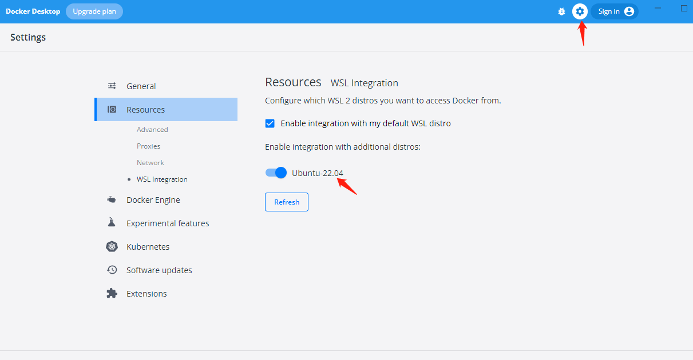

# Golang 微服务

## 开发环境
  - window 10 19043
  - Windows Docker Desktop
  - wsl/ubuntu20.04  (wsl 版本必须是2，windows 版本 >= 19043)
  - 开启 docker WSL 配置
  

## 安装

## 执行
  **必须在Linux环境下执行**
  - cd project 
  - 构建服务 `make up_build`
  - 构建前端 `make start` (会提示访问端口: http://localhost:9000/)

### 笔记
